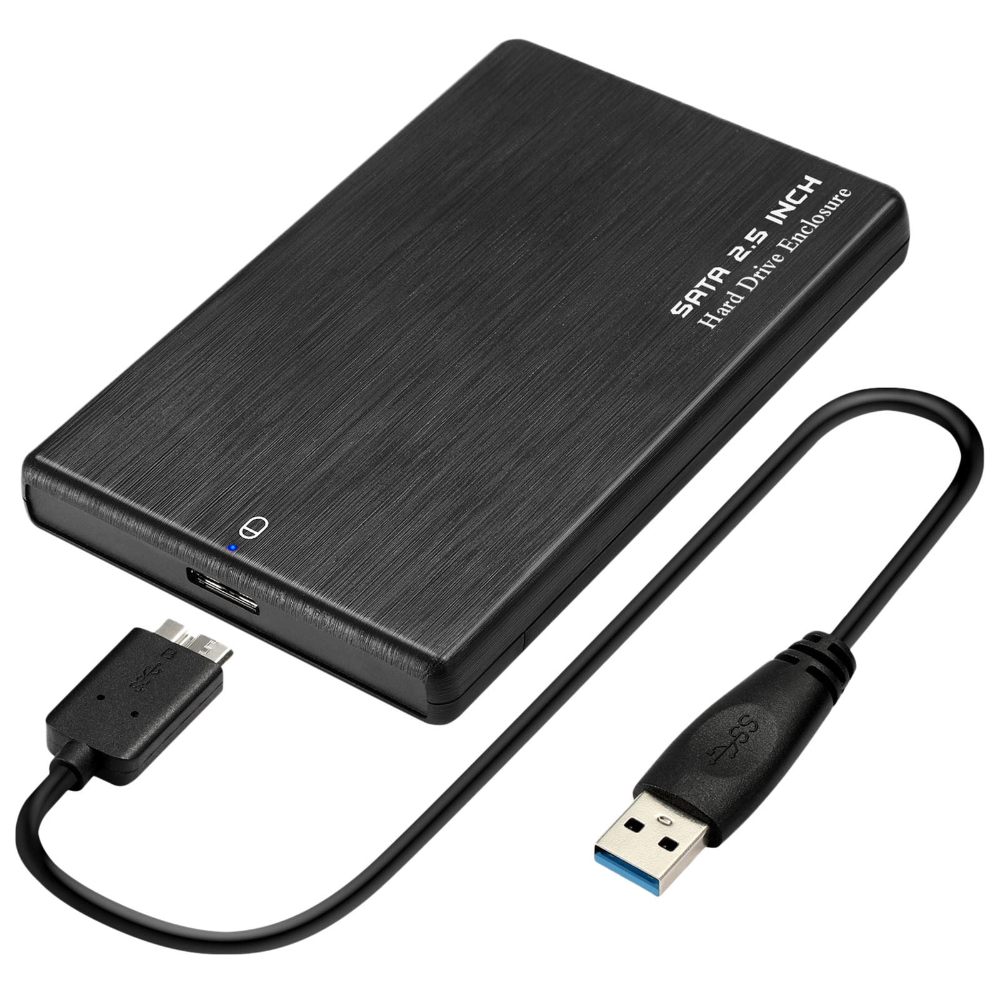
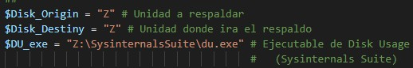
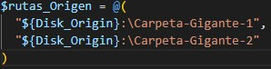
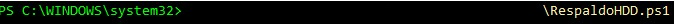
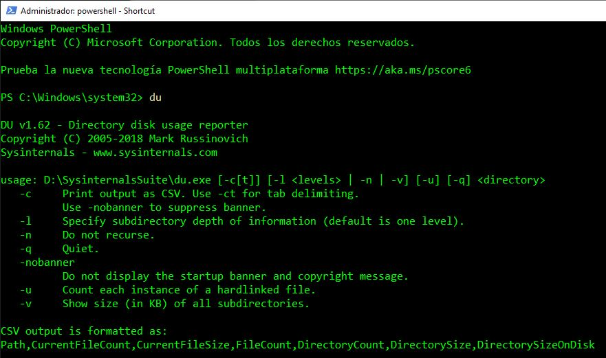

# Portable Disk Backup Script 💽
### PowerShell module for backing up a removable Disk Drive

  

  

  

## How to use?
### 1. Change the Origin and destination disk letters in the script
### 2. Write the route to your installation of SysInternalsSuite\du.exe

### 3. List the folders in the Origin Routes

### 4. Save the modified script 💾
### 5. Run inside the Power Shell Console with Administrator's privileges

# ⚠️ Note
### I assume that you have already edited the registry key `HKEY_LOCAL_MACHINE\SYSTEM\CurrentControlSet\Control\FileSystem` in regedit. You must change the value for the key `LongPathsEnabled` (DWORD) from 0 to 1 and then save.

# ⚠ Requirement
## 1. This script needs Sysinternals Suite installed in your PC to work properly.
Take it from the official site: https://learn.microsoft.com/es-es/sysinternals/downloads/sysinternals-suite

### Then Add the installation path to the environmental variables (Windows).
Start > Settings > System > About > Advanced System Settings (Right burguer menu) > Environmental Variables > System Variables > Path > Add your installation path "Z:\SysinternalsSuite"

### Accept the EULA (End User License Agreement)
> du -acceptEula

### Confirm it works in Power Shell

## 2. PowerShell needs to be unrestricted to run scripts
Try the following command:
> Set-ExecutionPolicy -ExecutionPolicy Unrestricted

See the official site: https://learn.microsoft.com/es-es/previous-versions/windows/powershell-scripting/hh847748(v=wps.640)?redirectedfrom=MSDN
